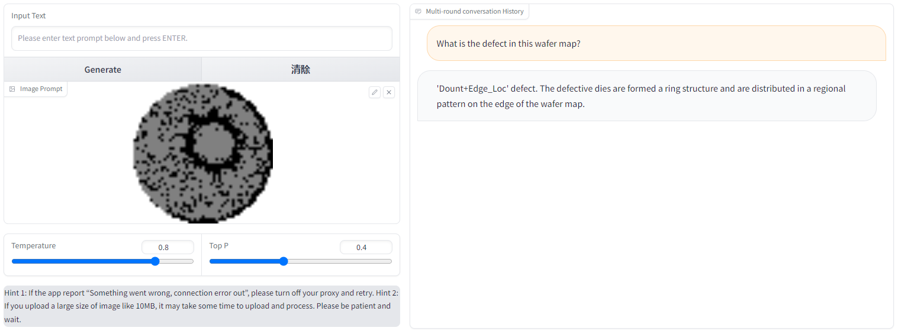

# Defect-GLM

## 介绍

最近，建立在通用语料下预训练的多模态大模型，如GPT-4和ViusalGLM，在日常生活领域展现出了优越的问答与图像语义理解能力。这些模型强大的知识储备、图像和语义理解能力和逻辑推理能力，让人们看到了通用人工智能的希望。这使得多模态大模型在很多领域展示出了革命性的应用潜力，并且其有望**变革工业设备智能运维领域的应用范式**，推动构建智能化和自动化的工业设备运营维护系统，并降低设备监测、运营和维护所需要的人力成本。为实现这一点，基于VisualGLM模型，**我们首次开发了Defect-GLM来探索多模态大模型在工业缺陷检测领域的研究和应用**。此外，**我们构建了一个大规模的图像-文本的半导体晶圆缺陷数据集**，以作为Defect-GLM案例验证数据集。Defect-GLM在半导体晶圆缺陷识别与分析应用上表现出了非凡的潜力，在实验数据集中够达到96%的识别准确率。

## 本项目贡献

<div align=center>
  
</div>

本项目探索了多模态大模型在工业缺陷检测领域的研究和应用，实现了基于多模态大模型的半导体晶圆缺陷识别和分析；
本项目借助开源晶圆数据集，并结合ChatGPT生成与人工设计的方式，构建了一个半导体晶圆缺陷诊断多模态数据集；
本项目使用所构建的晶圆多模态数据集在[VisualGLM-6B](https://github.com/THUDM/VisualGLM-6B)进行微调训练，并展示出了非凡的性能和潜力。
  
## 使用的开源数据集

[Mixed-type Wafer Defect Datasets](https://www.kaggle.com/datasets/co1d7era/mixedtype-wafer-defect-datasets)是一个开源晶圆缺陷数据集，共包括38种不同缺陷类型的38015张晶圆图片。

注意该公开数据集的原始数据类型并不直接适用于多模态模型训练。因此需要对数据集种晶圆图片进行合适的预处理，并结合ChatGPT生成与人工设计等方式获得问答语料，最终结合语料与预处理晶圆数据才得到了可以训练的多模态微调数据集。

## 使用

### 安装依赖
```bash
# 安装依赖
pip install -r requirements.txt
# 也可使用阿里云镜像安装依赖
pip install -i https://mirrors.aliyun.com/pypi/simple/ -r requirements.txt
```
此时默认会安装`deepspeed`库（支持`sat`库训练），此库对于模型推理并非必要，同时部分`Windows`环境安装此库时会遇到问题。 如果想绕过`deepspeed`安装，我们可以将命令改为：
```bash
# 安装依赖
pip install -i https://mirrors.aliyun.com/pypi/simple/ -r requirements_wo_ds.txt
# 安装SwissArmyTransformer
pip install -i https://mirrors.aliyun.com/pypi/simple/ --no-deps "SwissArmyTransformer>=0.3.6"
```
### 权重下载

|模型权重|下载链接|微调方法|
|:-|:-|:-|
|checkpoint-WaferGLM-6000|<a href='https://huggingface.co/YefriL/WaferGLM'></a>|LoRA|

### CLI推理

```python
python cli_demo.py --from_pretrained checkpoints/checkpoint_WaferGLM_6000 --prompt_en 'What is the defect in this wafer map?' --english
```

### WebUI运行

```python
python web_demo.py --from_pretrained checkpoints/checkpoint_WaferGLM_6000
```

此时访问`http://127.0.0.1:7860`即可

## 效果展示





## 未来展望

本项目以半导体晶圆缺陷检测为例，探索了多模态大模型在工业缺陷检测领域的研究和应用，在未来的研究中，我们将进一步从工业应用和模型优化两个发明开展工作：
1. 探索多模态大模型在轨道交通及其基础设施领域的研究，例如**基于多模态大模型的货车故障轨旁图像检测系统图像自动识别**；
2. 构建更庞大和文本语料更丰富的工业检测数据集，并在文本语料中融入维修决策规划等信息；
3. 探索基于工业物理知识嵌入的多模态大模型，以实现更准确的工业场景理解，给出可靠可信的决策结果；
4. 探索更大更复杂的多模态大模型在工业场景下的研究和应用，例如将VisualGLM-6B更换为GPT-4.

## 项目致谢

感谢[VisualGLM-6B](https://github.com/THUDM/VisualGLM-6B)为我们提供了基础的开源多模态大模型，并提供相关技术支持。


这项工作由[清华大学可靠性与质量研究院](https://iqr.tsinghua.edu.cn/)**博士生[王欢]**(http://huanwang.online/) 和电子科技大学**李晨希**完成，**指导老师为[李彦夫]**(http://www2.ie.tsinghua.edu.cn/liyanfu/)教授。


## 免责声明

本项目相关资源仅供学术研究之用，严禁用于商业用途。使用涉及第三方代码的部分时，请严格遵循相应的开源协议。模型生成的内容受模型计算、随机性和量化精度损失等因素影响，本项目无法对其准确性作出保证。对于模型输出的任何内容，本项目不承担任何法律责任，亦不对因使用相关资源和输出结果而可能产生的任何损失承担责任。

## 项目引用

如果你使用了本项目的模型，数据或者代码，请声明引用：

```bash
@misc{Wang2023LSF-Model,
      title={ChatGPT-Like Large-Scale Foundation Models for Prognostics and Health Management: A Survey and Roadmaps}, 
      author={Yan-Fu Li*, Huan Wang* and Muxia Sun},
      year={2023},
      publisher = {ArXiv Preprint},
      journal = {ArXiv Preprint},
      howpublished = {\url{https://arxiv.org/abs/2305.06472}},
}

@misc{Wang2023Defect-GLM,
      title={A Large-Scale Visual-Language Model for Industrial Defect Monitoring}, 
      author={Huan Wang, Chenxi Li, and Yan-Fu Li*},
      year={2023},
      publisher = {GitHub},
      journal = {GitHub repository},
      howpublished = {\url{https://github.com/WH-HuanWang/Defect-GLM}},
}
```

## 使用许可

此存储库遵循[CC BY-NC-SA](https://creativecommons.org/licenses/by-nc-sa/4.0/) ，请参阅许可条款。

